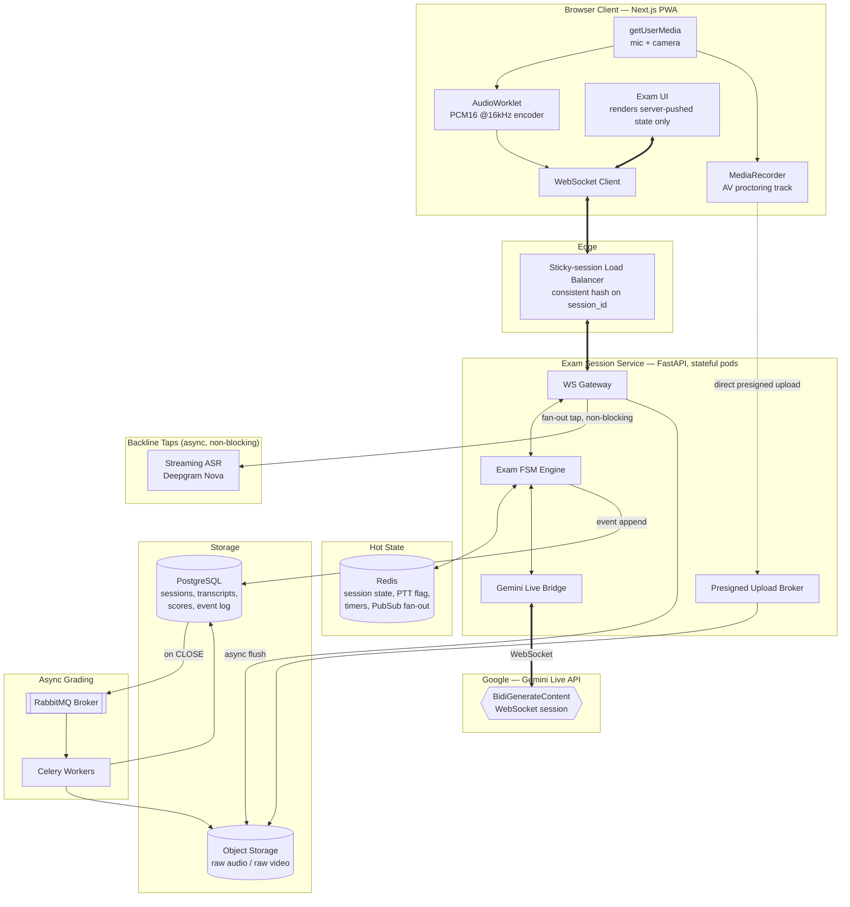
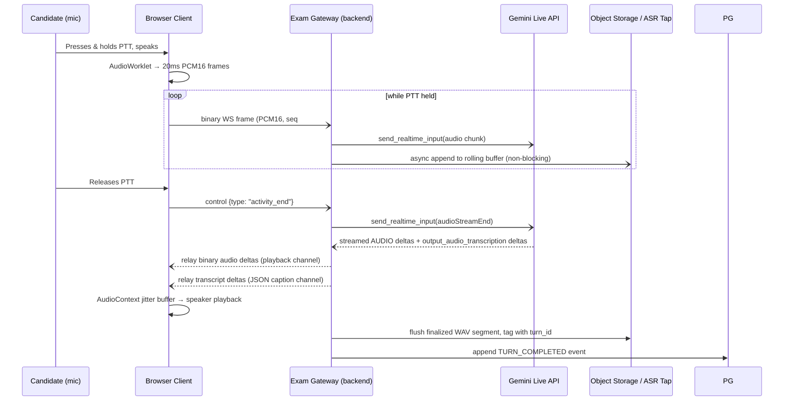

# SPEC_01 — System Architecture
### Virtual IELTS Speaking Examination Platform

| | |
|---|---|
| **Status** | Approved for build (v1.0) |
| **Owner** | Principal AI Systems Architecture |
| **Related Docs** | `SPEC_02_IELTS_FLOW_STATE_MACHINE.md`, `SPEC_03_ASYNC_GRADING_ENGINE.md`, `SPEC_04_REPOSITORY_AND_BUILD_PLAN.md` |
| **Scope** | End-to-end system design: media transport, live orchestration, state/resiliency, storage, non-functional targets |

---

## 1. Architectural Principles

These are non-negotiable design constraints. Every component decision below is derived from them.

1. **Server-authoritative, client-render-only.** The browser never decides exam state, timing, or scoring inputs. It renders what the backend tells it to render and streams raw media. This is what makes the exam tamper-resistant and resumable.
2. **Backend-mediated media bridge, not client-direct.** The browser never opens a WebSocket straight to Gemini. All audio transits the backend so we can (a) keep API credentials server-side, (b) tap the stream for durable recording and backline ASR without a second capture path, (c) enforce PTT/timer/business logic irrespective of client trustworthiness, and (d) swap or fail over the live model without a client release.
3. **Video is proctoring evidence, audio is the scoring substrate.** These are architecturally separate pipelines from the moment they leave `getUserMedia`. Video never touches the live inference loop or the grading engine — it is written straight to cold object storage.
4. **One connection ≠ one session.** A Gemini Live WebSocket connection is short-lived (bounded to roughly ten minutes) and a browser connection is inherently unreliable. The *exam session* is a durable server-side entity that outlives both. Reconnects bind to the existing session; they never create a new one.
5. **Event-sourced truth.** The exam's state is derived from an append-only event log, not from mutable row updates. This is what makes "resume exactly where they left off" a query, not a special case.
6. **Everything heavier than turn-taking is deferred.** If a computation isn't required to keep the live conversation feeling immediate, it does not run in the live request path. It becomes a Celery task.
7. **Auditability over black-box scoring.** Every number that contributes to a Band Score must be traceable to a computed feature and a provenance tag. The LLM Judge (Spec 03) synthesizes from evidence; it does not free-associate a score from raw audio.

---

## 2. Component Diagram



**Why stateful pods for the gateway:** the WS Gateway holds an open Gemini Live session and an in-memory jitter buffer per active exam. It is deployed as its own pod class with session-affinity load balancing (hash on `session_id`, not cookie), separate from the stateless REST API pods (auth, session creation, report retrieval) which scale independently behind a normal round-robin LB.

---

## 3. Tech Stack

| Layer | Technology | Rationale |
|---|---|---|
| Frontend framework | **Next.js 14+ (App Router), TypeScript** | SSR for auth/landing, CSR for the exam room; strong WebRTC/Web Audio ecosystem |
| UI components | **Tailwind CSS + shadcn/ui** | Fast, accessible, no runtime CSS-in-JS overhead during the exam (frame budget matters) |
| Client state | **Zustand** | Minimal, avoids Redux boilerplate for a state tree that's mostly "mirror what the server says" |
| Audio capture/playback | **Web Audio API — `AudioWorkletProcessor`** | Only path that gives sub-frame (≈20 ms) PCM access off the main thread without GC jank from `ScriptProcessorNode` |
| Proctoring capture | **`MediaRecorder` (video+audio, WebM/Opus)** | Independent of the live PCM tap; written straight to object storage, never decoded by the backend |
| Offline resiliency buffer | **IndexedDB (via `idb`)** | Client-side ring buffer of unsent audio chunks/state acks, replayed on reconnect |
| Backend API / WS gateway | **Python 3.12, FastAPI, Uvicorn (uvloop workers)** | Native ASGI WebSockets, async all the way down, first-class Pydantic v2 validation, pairs cleanly with `google-genai`'s async client |
| Live orchestration bridge | **`google-genai` SDK, `BidiGenerateContent` (Live API)** | Official bidirectional streaming client for Gemini Live |
| Hot session state | **Redis 7 (cluster mode)** | Sub-ms reads for FSM snapshot, TTL-based timers, Pub/Sub for horizontal gateway fan-out |
| Message broker (Celery) | **RabbitMQ** | Delivery-guaranteed queueing for grading jobs — a lost grading task is a customer-facing incident; Redis-as-broker's at-most-once semantics are the wrong trade-off here |
| Celery result/cache backend | **Redis** | Cheap, fast, ephemeral — fine for task results and rate-limit counters |
| Durable OLTP database | **PostgreSQL 16** | Event-sourced session log, transcripts, scores, candidate records; `pgvector` extension available for future semantic transcript search |
| ORM / migrations | **SQLAlchemy 2.0 (async) + Alembic** | Typed models shared between API and worker codebases |
| Object storage | **S3-compatible (AWS S3 prod / MinIO local-dev)** | Structured bucket topology (§7); presigned direct-from-browser upload for the AV proctoring track so large binaries never transit API pods |
| Task queue | **Celery 5.x** | Queue-partitioned workers (`media`, `asr`, `nlp`, `scoring`); Celery Beat for retention/cleanup; Flower for ops visibility |
| Live conversational model | **Gemini Live API, native-audio model family** (config-driven model ID, see §4.1) | Only viable option for duplex, low-latency, audio-native turn-taking without a bolt-on STT→LLM→TTS chain |
| Backline transcription | **Deepgram Nova (streaming + batch)**, self-hosted **WhisperX (large-v3 + wav2vec2 forced alignment)** as fallback | Word-level timestamps + confidence at the accuracy grading needs; Gemini's own live transcript is for UI captions and turn-detection only, never the scoring source of truth (see §4.3) |
| Pronunciation scoring | **Azure AI Speech Pronunciation Assessment**, self-hosted GOP fallback | Detailed in Spec 03 |
| Grammar/NLP | **spaCy (`en_core_web_trf`), LanguageTool (self-hosted)** | Detailed in Spec 03 |
| Rubric-synthesis LLM | **Model-agnostic `ScoringLLM` interface**, default implementation on Claude (structured JSON mode) | The live conversational model and the grading judge are different jobs with different requirements — duplex low-latency audio vs. meticulous structured-output rubric adherence — so the codebase must not hard-couple them to the same vendor. See Spec 03 §5. |
| Observability | **OpenTelemetry → Prometheus/Grafana, Sentry, structured JSON logs → Loki** | |
| IaC / deploy | **Docker Compose (dev), Kubernetes (prod), Terraform** | Gateway pods use `PodDisruptionBudget` + connection draining on deploy (§6.4) |
| CI/CD | **GitHub Actions** | Contract tests against a Gemini Live fixture/replay harness gate every merge (Spec 04) |

### 3.1 A note on video

The video track is captured, muxed with its own audio channel by `MediaRecorder`, and uploaded directly to `raw-video/` via presigned URL. It is **never** decoded, transcoded, or read by any live-path or grading-path service in v1. It exists solely as an evidentiary/proctoring artifact retrievable by a human reviewer. This is enforced architecturally, not just by convention: the video upload path has no network route to the ASR, NLP, or LLM services.

---

## 4. Live Pipeline Routing

### 4.1 Audio format & session contract

- **Client → Gemini (input):** 16-bit PCM, little-endian, mono, **16 kHz**, framed at 20 ms (320 samples/frame) by the `AudioWorkletProcessor`.
- **Gemini → Client (output):** 16-bit PCM, mono, **24 kHz**, streamed as incremental deltas.
- **Response modality:** `AUDIO` only for the live turn (a single response modality per Live session is enforced by the API). Text is never requested as the primary output — the audio-native path is the only one that meets the perceived-latency bar; a cascaded STT→text-LLM→TTS pipeline is explicitly rejected for the live loop.
- **Model selection is config-driven**, not hardcoded (`LIVE_MODEL_ID` env var, e.g. a `*-native-audio` Live-capable model). New Live model versions must be swappable via config + a canary cohort, without a client deploy — Google ships Live model updates on its own cadence and the platform must not freeze on a single model string.
- **Push-to-Talk overrides automatic VAD.** The Live API's built-in voice-activity detection is explicitly **disabled** in the session setup. Turn boundaries are instead driven deterministically by the client's PTT button:
  - PTT **press** → client begins streaming PCM frames; gateway sends `activityStart`.
  - PTT **hold** → frames stream continuously.
  - PTT **release** → client sends a control message; gateway sends `audioStreamEnd` / `activityEnd`, which finalizes the user's turn and triggers Gemini's response generation.
  - This is the direct technical implementation of the product requirement that ambient noise and thinking pauses must never trigger the examiner — there is no VAD to fool, because there is no VAD in the loop.

### 4.2 Hop-by-hop sequence



### 4.3 Two transcripts, deliberately

The Live API can emit `output_audio_transcription` for what *Gemini* said, and can be configured for input transcription of what the *candidate* said. These live transcripts are **fast but not grading-grade** — they are optimized for low-latency captioning and internal turn-detection, not for word-level timestamp precision or confidence calibration.

The platform therefore maintains two independent transcript lanes with distinct purposes, and this distinction is load-bearing for Spec 03:

| Lane | Source | Latency | Purpose | Used for scoring? |
|---|---|---|---|---|
| **Live caption lane** | Gemini `output_audio_transcription` + input transcription | Real-time (streamed deltas) | On-screen captions, FSM turn-completion signal, live UI state | No |
| **Backline evidence lane** | Deepgram Nova streaming tap on the same raw PCM (async, non-blocking of the live loop) → reconciled by a batch re-transcription pass over the finalized WAV once the session closes | Seconds to low-minutes, runs off the live critical path | Word-level timestamps + confidence, the canonical transcript persisted to `transcripts` | **Yes — this is the sole source of truth for grading** |

### 4.4 Latency budget

These are **engineering targets to validate empirically at load-test time against the currently deployed model version** — not a vendor-guaranteed SLA. The pipeline must be instrumented (OpenTelemetry spans per hop) so this table is a live dashboard, not a static assumption.

| Hop | Segment | Target P50 | Target P95 | Notes |
|---|---|---|---|---|
| 1 | Mic → PCM frame ready | 20 ms | 40 ms | Bounded by the 20 ms AudioWorklet frame size |
| 2 | Client → Gateway (WS) | 15 ms | 60 ms | Requires gateway PoPs close to candidate geography |
| 3 | Gateway → Gemini Live (WS) | 20 ms | 70 ms | **Co-locate gateway pods in the same cloud region as the Live API endpoint** — this hop dominates if misplaced |
| 4 | Gemini time-to-first-audio-byte | 250 ms | 600 ms | Native-audio model; the reason the audio-native path is mandated over a cascaded pipeline, which would add STT + TTS round-trips here |
| 5 | Gemini → Gateway relay | 20 ms | 70 ms | |
| 6 | Gateway → Client relay | 15 ms | 60 ms | |
| 7 | Client jitter buffer → speaker | 40 ms | 80 ms | Tunable trade-off against audio glitching on jitter |
| **Total: PTT-release → first audible reply** | | **~380 ms** | **~980 ms** | Design target. Conversational UX research generally treats sub-800 ms as "immediate"; P95 above ~1 s should alert. |

---

## 5. State & Resiliency Management

### 5.1 Session vs. connection

A **Gemini Live connection** is bounded to roughly a 10-minute WebSocket lifetime by the API itself. A **browser connection** can drop at any time (reload, network blip, laptop sleep). Neither of these is allowed to be the unit of durability. The **exam session** is:

- A row in `exam_sessions` (Postgres) — the durable identity.
- A materialized snapshot in Redis — the fast-path read for the gateway (`session:{id}:state`).
- An append-only stream in `exam_session_events` (Postgres) — the source of truth every snapshot is rebuilt from.

Neither the browser WebSocket nor the Gemini Live WebSocket is ever treated as authoritative state. They are transient transport for a session that outlives them.

### 5.2 Event-sourced FSM

```sql
CREATE TABLE exam_session_events (
    id              BIGSERIAL PRIMARY KEY,
    session_id      UUID NOT NULL REFERENCES exam_sessions(id),
    seq             BIGINT NOT NULL,              -- monotonic per session
    event_type      TEXT NOT NULL,                -- e.g. 'PHASE_TRANSITION', 'TURN_COMPLETED', 'DISCONNECTED', 'RESUMED'
    payload         JSONB NOT NULL,
    occurred_at     TIMESTAMPTZ NOT NULL DEFAULT now(),
    UNIQUE (session_id, seq)
);
```

Every FSM transition (Spec 02), every completed turn, every disconnect/reconnect is an event. Current state = `fold(events)`. The Redis snapshot is a cache of this fold, invalidated and rebuilt on every append; it is never the last-write-wins source itself, which is what makes it safe to lose Redis without losing exam state.

### 5.3 Reconnect / resume algorithm

```
1. Client reconnects with {exam_session_id, resume_token}.
2. Gateway validates resume_token against exam_sessions.resume_token (rotated per issue).
3. Gateway loads current FSM snapshot (Redis fast path, Postgres fold fallback).
4. Gateway checks for a stored Gemini `session_resumption` handle for this exam session:
     a. If within the API's resumption window → reconnect the Live WS using the handle
        (SessionResumptionConfig(handle=..., transparent=True)); server-side context is
        restored by Google, no client-visible re-priming needed.
     b. If the resumption window has elapsed (long prep-time pause, extended network outage) →
        open a fresh Live WS and deterministically re-seed context: replay the base system
        instruction + a compact reconstruction of "what phase we are in and what has been said
        so far" built from exam_session_events, via the phase-directive injection mechanism
        defined in Spec 02 §6. This is the documented fallback path, not an edge case to
        discover in production.
5. Gateway resumes any in-flight timers (Part 2 prep/cutoff) from their persisted deadline,
   not from zero — timers are stored as absolute deadlines (Redis key with TTL = remaining time),
   never as "seconds remaining" in application memory.
6. Gateway replays any unacknowledged transcript/state deltas the client buffer shows as missing
   (client sends last-received seq on reconnect; gateway diffs against exam_session_events).
7. FSM emits a RESUMED event; UI un-freezes.
```

### 5.4 Fairness policy for disconnects

- Heartbeat: WS ping every 15 s.
- No pong within 30 s → session marked `DISCONNECTED` (not `ABORTED`). **Any active countdown timer (Part 2 prep/cutoff) is paused, not left running** — a candidate must not lose exam time to a network blip. The pause duration is capped (grace window, e.g. 3 minutes) before the session moves to `ABORTED` and is flagged for human/support review.
- This pause-on-disconnect behavior is itself an event (`TIMER_PAUSED` / `TIMER_RESUMED`) — auditable, not silent.

### 5.5 Idempotent media persistence

- Every audio segment is written with a `(session_id, turn_id, seq)` composite key; retried uploads (from client buffer replay) are dedup'd on this key, not on wall-clock arrival order.
- Presigned multipart upload with checksum validation for the video track, uploaded directly browser → S3 (never proxied through API pods).

### 5.6 Deploy-time connection draining

Because gateway pods hold live Gemini WS sessions in memory, rolling deploys use: mark pod `NotReady` → stop accepting new session assignments → wait for in-flight sessions to reach a natural phase boundary or a bounded max-drain timeout → force those remaining into the resume path (send a `go_away`-equivalent notice to clients so they reconnect to a fresh pod using the same resumption/event-sourcing path described in §5.3). A deploy is, from the exam's perspective, just another disconnect/resume cycle — which is precisely why §5.3 has to be correct.

---

## 6. Core Data Model (summary)

| Table | Purpose |
|---|---|
| `candidates` | Identity, ID-verification result/hash (not raw ID image beyond policy retention window) |
| `exam_sessions` | Durable session identity, current phase snapshot pointer, resume token, Gemini resumption handle |
| `exam_session_events` | Event-sourced FSM log (§5.2) |
| `cue_cards` | Versioned Part 2 cue card bank (topic, bullet points, linked Part 3 discussion themes) |
| `audio_segments` | Per-turn raw audio pointers into object storage + sequence/checksum metadata |
| `video_segments` | Proctoring video pointer, never joined to scoring tables |
| `transcripts` | Word-level backline transcript (word, start_ms, end_ms, confidence, speaker, turn_id) — canonical scoring input |
| `feature_vectors` | Computed FC/LR/GRA/P feature JSON per phase + session aggregate, with provenance tags (Spec 03) |
| `grading_jobs` | Celery job/task status, retry count, partial-failure flags |
| `band_score_reports` | Final synthesized scores, justifications, evidence references, human-review flags |

---

## 7. Object Storage Topology

| Prefix | Contents | Retention | Access |
|---|---|---|---|
| `raw-video/{session_id}/full.webm` | Full proctoring recording, muxed A/V | Policy-defined (e.g. 90 days), configurable per institution contract | Private, presigned, never referenced by scoring services |
| `raw-audio/{session_id}/segments/{turn_id}_{seq}.wav` | Per-turn raw PCM tapped live | Session lifetime + grading buffer | Private |
| `raw-audio/{session_id}/canonical.flac` | Stitched full-session audio, produced by the `finalize_media` Celery task | Long-term (scoring evidence of record) | Private |
| `exports/{session_id}/report.pdf` | Candidate/institution-facing score report | Long-term | Expiring signed URL |
| `rubric-assets/` | **Licensed** official rubric reference text, loaded at runtime by the LLM Judge (Spec 03 §5) | N/A — configuration, not user data | Server-side secret store only, never web-accessible |

---

## 8. Security & Compliance Notes

- **Credentials never reach the browser.** All Gemini/Deepgram/Azure/LLM-Judge credentials live server-side. If a client-direct Live connection is ever introduced as a latency optimization in a later version, it must use the Live API's ephemeral-token issuance flow (`AuthTokenService.CreateToken`) with short TTLs — a raw API key must never be shipped to a browser.
- **Explicit recording consent** is captured (checkbox + spoken disclosure by the examiner persona) before `INIT_DEVICE_CHECK` transitions into any state that begins persisting media.
- **PII minimization**: ID-verification is architected to store a verification *result* and a cryptographic hash by default; retention of the raw ID image beyond the verification step is a product/legal policy decision that must be explicitly configured, not a default.
- **Encryption**: TLS 1.3 in transit everywhere; SSE-KMS at rest for all object storage buckets; Postgres encryption at rest via managed provider.
- **Data subject deletion**: `exam_session_events` and all storage objects are keyed by `session_id`/`candidate_id`, enabling a single cascading erasure workflow for right-to-erasure requests.

---

## 9. Non-Functional Targets

| Dimension | Target | Basis |
|---|---|---|
| Concurrent live exam sessions per region | ≤ 1,000 | Aligned to Gemini Live API's documented per-project concurrent-session ceiling on standard pay-as-you-go throughput; scale beyond this requires provisioned throughput and/or multi-project sharding |
| Gateway pod scaling | Horizontal, session-affinity on `session_id` hash | Stateful WS holder; see §2 |
| Uptime (exam-taking window) | 99.9% | Exam sessions are time-boxed and revenue/reputation-sensitive |
| Postgres RPO / RTO | ≤ 5 min / ≤ 15 min | Event-sourced log is the recovery anchor |
| Grading turnaround (P95, session close → report ready) | ≤ 10 minutes | Celery pipeline (Spec 03); not a live-path constraint |
| First-audible-reply latency | See §4.4 | |
