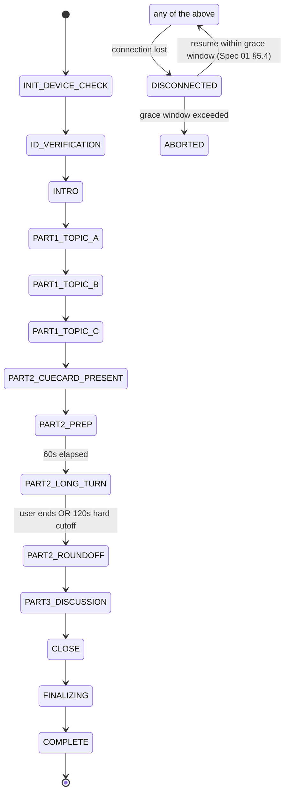

# SPEC_02 — IELTS Flow State Machine
### Virtual IELTS Speaking Examination Platform

| | |
|---|---|
| **Status** | Approved for build (v1.0) |
| **Depends on** | `SPEC_01_SYSTEM_ARCHITECTURE.md` (§5 State & Resiliency, §4 Live Pipeline) |
| **Scope** | Exam-phase business logic: the FSM a real exam session walks through, Part 2 timer orchestration, prompt/persona strategy |

> **Note on source material.** IELTS's overall *structure* (three parts, their general purpose, and typical timing bands) is public exam-format knowledge and is used here only at that level. This document does not reproduce, and the platform must not hardcode, Cambridge/IDP/British Council's proprietary band-descriptor wording or licensed test content — see Spec 03 §5 for how that is handled as an externally supplied, licensed configuration asset.

---

## 1. Phase Table

This is the exam-business-logic FSM. It is orthogonal to the connection-resiliency overlay (`DISCONNECTED` / `RESUMED`) defined in Spec 01 §5 — any phase below can be interrupted by a disconnect and resumed back into the same phase without loss.

| Phase | Purpose | Timer | Entry Trigger | Exit Condition | Persisted Artifact |
|---|---|---|---|---|---|
| `INIT_DEVICE_CHECK` | Mic/camera/network check | None | Candidate opens exam room | Client confirms device readiness | Device-check event only, no media recorded |
| `ID_VERIFICATION` | Identity confirmation | Soft (2 min guidance) | Device check passes | ID captured + confirmed (auto or human-reviewed) | Verification result/hash; video recording begins here |
| `INTRO` | Examiner introduces persona, confirms candidate name aloud, states recording has started | None | ID verified | Examiner completes scripted opening, candidate responds | Audio recording begins here |
| `PART1_TOPIC_A/B/C` | Everyday/familiar topics, short Q&A | Soft target ~4–5 min combined for all three | Intro complete | 3 topics × ~4–5 exchanges each completed | Turn-level audio + transcript per topic |
| `PART2_CUECARD_PRESENT` | Cue card metadata pushed to UI | None (instant) | Part 1 complete | Card rendered client-side, ack received | Selected `cue_card_id` bound to session |
| `PART2_PREP` | Silent preparation, optional note scratchpad | **Hard 60 s** | Card ack received | Timer expiry (automatic) | Prep timer event; scratchpad text (if any), not scored |
| `PART2_LONG_TURN` | Uninterrupted long turn on the cue card | **Hard 120 s cutoff** | Prep timer expiry | PTT released by candidate **or** 120 s hard cutoff | Full-turn audio + transcript |
| `PART2_ROUNDOFF` | 1–2 short wrap-up questions | Soft, ~30 s | Long turn ends | Examiner completes round-off | Turn audio + transcript |
| `PART3_DISCUSSION` | Abstract discussion thematically linked to the Part 2 topic | Soft target ~4–5 min | Round-off complete | Examiner completes discussion arc (question budget or soft timer) | Turn-level audio + transcript |
| `CLOSE` | Examiner closing statement | None | Part 3 complete | Scripted close delivered | — |
| `FINALIZING` | Client flush of any buffered/unsent media | Watchdog (e.g. 60 s max wait) | Close delivered | All segment upload acks received | Upload completeness manifest |
| `COMPLETE` | Session sealed, immutable | — | Finalizing acked | — | `exam_sessions.completed_at` set; grading job enqueued |

---

## 2. FSM Diagram



---

## 3. Part 2 Orchestration — Deep Dive

Part 2 is the phase with the strictest real-time contract in the whole exam: a **silent 60-second prep window** and a **hard 120-second speaking cutoff**, both enforced server-side regardless of what the client or the model "think" is happening.

### 3.1 Cue card delivery

The cue card is **never spoken freeform by Gemini** — it is a deterministic, versioned record (`cue_cards` table: topic prompt + 3–4 bullet points + linked Part 3 themes) that the backend pushes to the client as structured JSON over the WS data channel, rendered by the UI directly. The same content is simultaneously injected into the Live session as a phase directive (§6.2) so Gemini's spoken introduction of the task references the same card the candidate is looking at — the model narrates a card it was handed, it does not invent or paraphrase one.

```json
{
  "type": "cue_card",
  "cue_card_id": "cc_0142",
  "topic": "Describe a skill you learned that you found difficult at first.",
  "bullets": [
    "what the skill was",
    "why you decided to learn it",
    "what difficulties you had",
    "and explain how you felt once you had learned it"
  ]
}
```

### 3.2 Deterministic vs. generative speech

Two purely mechanical cues in Part 2 — *"you have one minute to prepare"* and *"please begin speaking now"* — are **pre-generated TTS assets**, not live Gemini generations. This is a deliberate reliability choice: a mechanical, identical-every-time announcement should not depend on a live model round-trip that could be slow, drift in wording, or (rarely) mis-fire. Gemini is reserved for the parts of the interaction that require genuine language understanding — introducing the topic, listening, following up, and delivering the timed interruption in §3.4, which does require the model to gracefully finish a thought rather than just play a canned clip mid-sentence.

### 3.3 Timer subsystem

Timers are **absolute deadlines**, not "seconds remaining" counters in application memory — stored as a Redis key with a TTL equal to the remaining duration, mirrored by an `asyncio` watchdog task on the owning gateway pod. This is what makes them survive a pod-level disconnect/resume cycle (Spec 01 §5.3/§5.4): on resume, the new pod reads the remaining TTL and restarts its watchdog from there, it does not reset to 60/120.

**Prep timer (`PART2_PREP`):**

```python
async def part2_prep_watchdog(session_id: str):
    deadline = await redis.get_deadline(session_id, "part2_prep")   # absolute epoch ms
    while time.time() < deadline:
        if await fsm.get_state(session_id) != "PART2_PREP":
            return  # phase changed underneath us (e.g. resumed elsewhere) — bail cleanly
        await asyncio.sleep(0.25)
    await audio_bridge.play_scripted_asset(session_id, "please_begin_speaking_now.wav")
    await fsm.transition(session_id, to="PART2_LONG_TURN", reason="prep_timer_expired")
```

**Long-turn hard cutoff (`PART2_LONG_TURN`):** this is the one place in the whole exam where the backend forcibly interrupts the model rather than waiting for it to yield the turn.

```python
async def part2_long_turn_watchdog(session_id: str):
    WARN_AT_S = 115     # give Gemini a chance to land the plane gracefully
    HARD_CUTOFF_S = 120
    deadline = await redis.get_deadline(session_id, "part2_long_turn")
    warned = False

    while True:
        remaining = deadline - time.time()
        if await fsm.get_state(session_id) != "PART2_LONG_TURN":
            return                              # candidate finished early — normal exit

        if remaining <= (HARD_CUTOFF_S - WARN_AT_S) and not warned:
            await gemini_bridge.inject_directive(session_id, DIRECTIVE_PART2_WARN)
            warned = True

        if remaining <= 0:
            await gemini_bridge.force_mute_input(session_id)   # stop forwarding candidate audio
                                                                # even if PTT is still physically held
            await gemini_bridge.inject_directive(session_id, DIRECTIVE_PART2_HARD_STOP)
            await fsm.transition(session_id, to="PART2_ROUNDOFF", reason="hard_cutoff")
            return

        await asyncio.sleep(0.25)
```

### 3.4 The interruption itself is polite, not abrupt

```
DIRECTIVE_PART2_WARN = """
[EXAMINER_DIRECTIVE]
Fewer than five seconds of the candidate's two minutes remain. If they are
mid-sentence when time runs out, let them finish the clause they are on —
do not cut off a word. Do not ask a new question. Prepare to close the turn.
[/EXAMINER_DIRECTIVE]
"""

DIRECTIVE_PART2_HARD_STOP = """
[EXAMINER_DIRECTIVE]
Time is up. Say, in your own natural examiner voice:
"Thank you, that's the end of your two minutes."
Then stop talking and wait. Do not summarize their answer. Do not comment
on quality. Do not ask a follow-up here — that happens in the next phase.
[/EXAMINER_DIRECTIVE]
"""
```

This produces the required product behavior — *"a hard, server-side 2-minute recording cutoff that politely interrupts the user"* — as two cooperating mechanisms: a **hard, non-negotiable input mute** (the recording/scoring boundary is exact and cannot be talked past) and a **generative, natural-sounding closing line** (the candidate experiences a human-feeling interruption, not a dead connection).

---

## 4. Part 1 & Part 3 Notes

- **Part 1** runs three rotating everyday-topic sets (`PART1_TOPIC_A/B/C`), each a short bounded Q&A exchange. Topic sets are versioned and randomly assigned per session from a bank, avoiding item repetition across a candidate's retakes (tracked via `candidates.previous_topic_sets`).
- **Part 3** is thematically bound to the Part 2 cue card via `cue_cards.linked_part3_themes` — the discussion is not a random abstract topic, it is the "zoom out" of what the candidate just spoke about, matching the real exam's structural logic. Exit from Part 3 is a soft budget (either a question count, e.g. 5–7 examiner questions, or a soft time budget of ~4–5 minutes), whichever the phase-directive strategy in §6 determines is closer to natural completion — Part 3 is intentionally the least rigid phase because real abstract discussion has variable natural length.

---

## 5. Edge Case Handling

| Situation | Behavior |
|---|---|
| Candidate silent > 8 s after a question | One gentle re-prompt directive injected; if still silent, examiner moves on (never repeats a question more than once) |
| Candidate goes off-topic / rambles beyond what a short-answer Part 1 question expects | Directive nudges the model to politely move to the next question rather than let one answer consume the topic's time budget |
| Candidate asks the examiner a question ("what does X mean?", "is this correct?") | Directive instructs the model to politely decline to define/teach/confirm and redirect the candidate to answer as best they can — a real examiner does not tutor mid-exam |
| Audio dropout mid-turn (network) | Handled by Spec 01 §5.4 — active timers pause, not penalized |
| Candidate speaks a language other than the exam language throughout | Directive flags the turn as `low_asr_confidence` / `language_mismatch` for backline review rather than silently scoring it |
| ID mismatch at `ID_VERIFICATION` | Session halts before any scored content begins; escalates to a human-review queue, never auto-fails silently |
| Candidate expresses genuine distress (not ordinary exam nerves) | A dedicated directive authorizes the examiner persona to pause the exam and offer a break / human-proctor escalation path, rather than mechanically continuing through the phase timeline |

---

## 6. Prompt Engineering & Persona Isolation

### 6.1 System instruction structure

Following the layering that gets the most reliable behavior out of the Live API — persona, then ordered conversational rules, then guardrails, each as a distinct section of one system instruction (system instructions cannot be swapped mid-connection, only at session-resumption boundaries, so this must be complete and stable at connect time) — the base system instruction is structured as:

```text
[PERSONA]
You are "the Examiner" — a calm, neutral, professionally warm IELTS Speaking
examiner conducting a live spoken-English proficiency exam. You have run
thousands of these exams. Your manner is courteous but measured: you are not
the candidate's friend, coach, or tutor for the duration of this exam.

[CONVERSATIONAL RULES — follow in this order of priority]
1. You will receive out-of-band stage directions wrapped in
   [EXAMINER_DIRECTIVE] ... [/EXAMINER_DIRECTIVE]. These are never spoken
   aloud, never acknowledged, never referenced ("as I was just told to say").
   Treat them as your own next intention, not as something said to you.
2. Ask only one question at a time. Keep your own turns short — you are
   here to prompt and listen, not to talk at length.
3. Follow the structure and timing of the phase you are currently in exactly
   as instructed by directives; do not skip ahead or go back a phase.
4. Never explain, correct, or teach English during the exam. Never define a
   word the candidate asks about. If asked, politely redirect them to answer
   as best they can.

[GUARDRAILS]
- Never say things like "great answer," "well done," "good job," or otherwise
  evaluate quality aloud, in any phase. A real examiner gives no feedback
  during the test.
- Never break character to mention you are an AI, a language model, or a
  simulation.
- Never offer generic assistant helpfulness ("would you like help with...",
  "I can also...").
- Never reveal, discuss, or hint at how scoring works.
- If the candidate becomes distressed beyond ordinary exam nerves, follow the
  distress-handling directive if one is provided; otherwise continue steadily
  and neutrally.
```

### 6.2 Dynamic phase-directive re-injection

Because the system instruction is fixed for the life of a connection, **per-phase behavioral steering is delivered as regular in-context turns**, not as system-instruction edits. Each phase transition, the backend sends a directive turn wrapped in the `[EXAMINER_DIRECTIVE]` tokens the base persona was trained (via rule 1 above) to treat as silent stage direction rather than dialogue:

```json
{
  "role": "user",
  "content": "[EXAMINER_DIRECTIVE]\nYou are now beginning Part 2. The candidate has just been shown this cue card: 'Describe a skill you learned that you found difficult at first' with bullet points on what it was, why they chose it, difficulties, and how they felt afterward. Introduce the task in one or two sentences, tell them they have one minute to prepare, then stay silent until instructed. Do not read the bullet points aloud verbatim — the candidate can see them.\n[/EXAMINER_DIRECTIVE]"
}
```

This pattern generalizes: every phase transition in §1 has a corresponding directive template stored in a versioned `prompt-templates/` asset (Spec 04 §2), so prompt changes are reviewable diffs, not buried inline strings.

### 6.3 Anti-drift guardrails for long sessions

A full exam session can run 15–20 minutes of real time. Two mechanisms protect persona stability over that duration:

1. **Context-window compression is safe by construction for the persona.** The Live API's sliding-window compression, when triggered on long sessions, always preserves the system instruction at the start of the resulting context — so the core persona/guardrails never age out. Phase directives injected as ordinary turns, however, *can* be pruned by compression on a long enough session.
2. **Because of (1), directives are periodically re-anchored**, not injected once and assumed permanent: at minimum on every phase transition (§6.2), and additionally every ~6 turns within any single long phase (Part 1's topic sets, Part 3's discussion), a short re-anchor directive is injected reasserting the two or three guardrails most likely to drift (no praise, no teaching, one question at a time) without repeating the whole persona block.

### 6.4 What "never breaking character" looks like operationally

The negative constraints in §6.1 are enforced at three layers, not just prompted-and-hoped-for:
- **Prompt layer**: explicit negative instructions (§6.1 guardrails), re-anchored (§6.3).
- **Runtime layer**: the backend never surfaces raw model text to the candidate without having gone through the phase-directive-aware turn — if a directive was just injected asking for a specific closing line (§3.4), the FSM can validate the model's next utterance contains the expected closing content before advancing the phase, and can retry with a stronger directive if it doesn't (bounded retry, then fall back to the deterministic scripted asset from §3.2 as a last resort).
- **Audit layer**: every model turn is persisted (Spec 01 §6) with its triggering directive, so persona-drift incidents are diagnosable after the fact against the exact directive that was live at the time.
