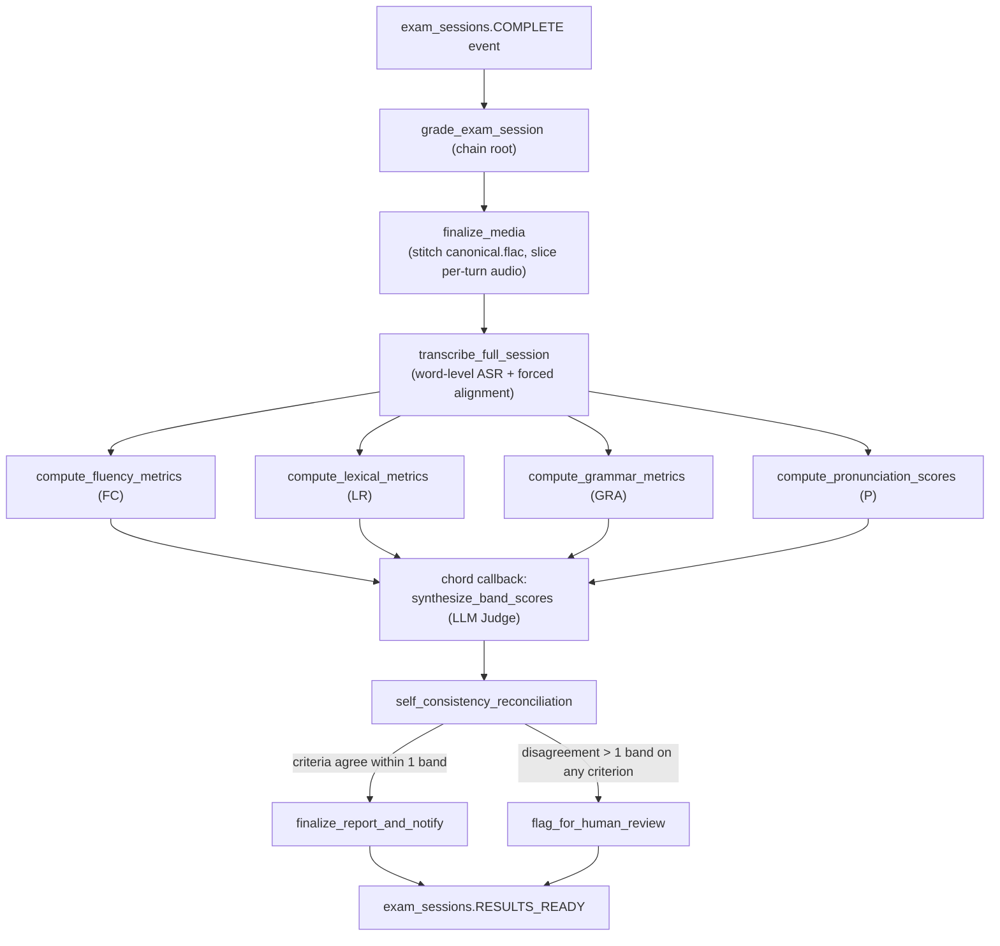

# SPEC_03 — Asynchronous Grading Engine
### Virtual IELTS Speaking Examination Platform

| | |
|---|---|
| **Status** | Approved for build (v1.0) |
| **Depends on** | `SPEC_01_SYSTEM_ARCHITECTURE.md` (§6 Data Model, §7 Storage), `SPEC_02_IELTS_FLOW_STATE_MACHINE.md` (transcript/turn provenance) |
| **Scope** | The Celery pipeline that turns a closed exam session into a defensible, evidence-backed 0–9 Band Score across the four IELTS Speaking criteria |

---

## 1. Design Principle: Evidence Before Judgment

The LLM Judge in §5 never scores from raw transcript alone. Every band it assigns must be traceable to a **computed, deterministic feature** with an explicit provenance tag. This is what "auditable" and "defensible" mean operationally: a human reviewer — or a legal/compliance challenge — can be pointed at the exact metric, formula, and source segment behind any score, not just at an LLM's say-so.

---

## 2. Celery Pipeline Topology

### 2.1 Trigger

The `COMPLETE` FSM event (Spec 02 §1) enqueues a single root job:

```python
grade_exam_session.delay(session_id=session_id)
```

### 2.2 Pipeline DAG



- **`finalize_media → transcribe_full_session`** is a strict chain: nothing downstream can run against un-transcribed audio.
- **The four feature-extraction tasks (`E1`–`E4`) run as a parallel `group`**, all depending only on the finalized transcript + canonical audio — none of them depend on each other, which is what makes them safely parallelizable and independently retryable.
- **`synthesize_band_scores` is a `chord` callback** — it only fires once all four feature tasks succeed (or have exhausted retries and reported a partial-failure feature vector, §2.4).

### 2.3 Celery configuration

```python
# celery_app.py
CELERY_TASK_ROUTES = {
    "grading.tasks.media.*":    {"queue": "media"},
    "grading.tasks.asr.*":      {"queue": "asr"},
    "grading.tasks.nlp.*":      {"queue": "nlp"},
    "grading.tasks.scoring.*":  {"queue": "scoring"},
}

CELERY_TASK_ACKS_LATE = True                  # a crashed worker mid-task must not lose the job
CELERY_TASK_REJECT_ON_WORKER_LOST = True
CELERY_BROKER_URL = "amqp://..."              # RabbitMQ — delivery guarantees matter here (Spec 01 §3)
CELERY_RESULT_BACKEND = "redis://..."

CELERY_TASK_TIME_LIMIT = {
    "grading.tasks.media.finalize_media":              300,
    "grading.tasks.asr.transcribe_full_session":        600,
    "grading.tasks.nlp.compute_fluency_metrics":        120,
    "grading.tasks.nlp.compute_lexical_metrics":        120,
    "grading.tasks.nlp.compute_grammar_metrics":        180,
    "grading.tasks.nlp.compute_pronunciation_scores":   300,
    "grading.tasks.scoring.synthesize_band_scores":     120,
}

CELERY_TASK_MAX_RETRIES = 3
CELERY_TASK_RETRY_BACKOFF = True
```

**Queue sizing rationale:** `asr` and `pronunciation` are I/O/compute-heavy (external API calls or local model inference) and get dedicated worker pools sized independently of the lightweight `nlp` (spaCy/LanguageTool, CPU-bound but fast) and `scoring` (mostly waiting on an LLM API call, high concurrency / low CPU) pools.

### 2.4 Idempotency & partial failure

- Every task is keyed by `(session_id, task_name)` and is safe to re-run — outputs are upserted, not appended.
- If one of the four `E1`–`E4` feature tasks exhausts its retries, the chord callback still fires (via a `chord` error-tolerant fan-in), but `synthesize_band_scores` receives an explicit `feature_status: "missing"` marker for that criterion instead of a fabricated value, and the resulting report is marked `GRADING_FAILED_PARTIAL` with the specific missing criterion named — never silently averaged around.
- A missing-feature session supports **targeted re-run** of just the failed sub-task (`compute_pronunciation_scores.delay(session_id)` alone), not a full pipeline re-run — important for both cost and turnaround time when, say, only the pronunciation vendor had a transient outage.

---

## 3. Backline Transcription (feeding all four criteria)

- **Primary:** Deepgram Nova, run in two passes — a streaming tap during the live session (Spec 01 §4.3, UI-latency-only, discarded after use) and an authoritative **batch re-transcription of the finalized `canonical.flac`** once the session closes, which is what actually populates the `transcripts` table. Batch mode over the full, clean, non-network-jittered file is materially more accurate than the live tap and is worth the extra minute of turnaround given grading is not latency-sensitive (Spec 01 §9).
- **Fallback:** self-hosted **WhisperX** (Whisper large-v3 decoding + wav2vec2-based forced alignment) — used automatically if the primary vendor call errors, times out, or returns below a configured confidence floor for a segment. This also serves as a periodic cross-validation sample (a small % of sessions dual-transcribed and diffed) to catch silent vendor drift.
- Every stored word row carries `{word, start_ms, end_ms, confidence, source: "deepgram"|"whisperx", turn_id, speaker}`.

---

## 4. The Four Criteria — Extraction Design

### 4.1 Fluency & Coherence (FC)

**Inputs:** word-level timestamps + confidence (§3), turn/phase boundaries from `exam_session_events` (Spec 01 §5.2), a dependency parse of the transcript (shared with GRA, §4.3).

| Metric | Formula / Method | Why it's in the vector |
|---|---|---|
| Speech Rate (SR) | `total_words / total_turn_duration_s × 60` | Raw pace, includes pausing |
| Articulation Rate (AR) | `total_syllables / phonation_time_s` (phonation time = turn duration minus all silent-pause time) | Pace with thinking-time factored out; a classic SLA fluency correlate. Syllable counts via a CMU-dict/phonetic syllabifier over the transcript |
| Phonation Time Ratio | `phonation_time_s / total_turn_duration_s` | How much of the turn was actually speech vs. silence |
| Mean Length of Run (MLR) | Mean number of words between silent pauses ≥ 0.3 s | Strong, well-established fluency correlate — longer uninterrupted runs indicate more automatized speech |
| Silent pause rate | Count of gaps ≥ 0.3 s between consecutive words, per 100 words; separately bucketed as micro (0.3–1.0 s) vs. macro (> 1.0 s) | Frequency *and* severity of hesitation |
| Pause placement | Each pause classified as clause-boundary vs. mid-clause using the dependency parse | Mid-clause pausing is a stronger fluency penalty than clause-boundary pausing in applied-linguistics scoring practice |
| Filled-pause rate | Lexicon match on transcript tokens (um, uh, erm, and discourse-filler uses of "like"/"you know") per 100 words | Direct hesitation signal |
| Self-repair rate | Rule-based detection: immediate n-gram repetition, abandoned-clause-plus-restart patterns, explicit correction markers ("I mean," "sorry," "actually") | Distinguishes disfluency-from-repair vs. disfluency-from-difficulty |
| Discourse marker usage | Frequency + type diversity of connectives (firstly, however, in addition, so, because, on the other hand, ...) | Coherence signal — organizing extended discourse, not just individual-sentence fluency |

Output: a `FluencyFeatureVector` computed per phase (Part 1 / Part 2 / Part 3) and as a session-level aggregate, since fluency legitimately varies by task type (short-answer Part 1 vs. long-turn Part 2).

### 4.2 Lexical Resource (LR)

**Inputs:** transcript, tokenized/lemmatized via spaCy.

| Metric | Method |
|---|---|
| Lexical diversity | **MTLD** (Measure of Textual Lexical Diversity) and **MATTR** (moving-average type-token ratio), not raw TTR — raw TTR is invalid here because turn lengths vary by design across phases/candidates; MTLD/MATTR are length-independent |
| CEFR profile | Each content lemma mapped to a CEFR band (A1–C2) via a graded reference lexicon; output is a distribution (e.g. "62% A2, 24% B1, 11% B2, 3% C1+") plus a "beyond-B2 ratio" as the primary sophistication signal |
| Frequency-based rarity | Off-top-5000 (COCA-style frequency band) word ratio, as a secondary sophistication signal independent of the CEFR lexicon's coverage gaps |
| Collocation / idiomatic usage | Statistical match against a curated collocation/idiom bank; supplemented by an **LLM-assisted flagging pass** that tags natural idiomatic phrasing the statistical matcher misses — this pass only *tags candidate phrases into the feature log*, it does not itself assign a score. Scoring judgment stays reserved for the rubric-synthesis stage (§5), keeping this step auditable rather than an opaque secondary opinion |
| Lexical appropriacy errors | LanguageTool word-choice/collocation error flags, counted and categorized |

Output: a `LexicalFeatureVector` per phase + session aggregate.

### 4.3 Grammatical Range & Accuracy (GRA)

**Inputs:** transcript, segmented into **T-units** (a main clause plus any subordinate clauses attached to it — the standard applied-linguistics unit for measuring spoken/written syntactic complexity) via spaCy dependency parsing.

| Metric | Method |
|---|---|
| Mean Length of T-unit | `total_words / total_T_units` |
| Clauses per T-unit | Dependent-clause count / T-unit count |
| Dependent Clause Ratio | Dependent clauses / total clauses |
| Complex nominals per clause | Noun phrases with attached relative clauses, participial modifiers, or nominalizations, per clause |
| Coordination Index | Coordinated clauses / total clauses |
| Structural range | Distinct tense/aspect forms, passive-voice usage, conditional structures, relative clauses, modal diversity — tagged via POS + dependency patterns, reported as a diversity count, not a raw frequency |
| Accuracy | **LanguageTool** (rule-based/statistical checker) as primary, cross-checked by a neural grammar-error-detection tagger as a second opinion; outputs error-free-clause ratio, errors per 100 words, and an error-type taxonomy breakdown (subject–verb agreement, article, preposition, tense, word order) |

Output: a `GrammarFeatureVector` per phase + session aggregate.

### 4.4 Pronunciation (P)

**Primary:** submit each candidate audio segment, together with its backline-ASR transcript as the reference text (this is **unscripted-mode** assessment — there is no fixed script, so the hypothesis transcript stands in as the reference), to **Azure AI Speech Pronunciation Assessment**. This returns, per phoneme/word/utterance: accuracy, fluency, completeness, and prosody sub-scores plus confidence.

**Fallback (self-hosted, triggered automatically):** a **Goodness-of-Pronunciation (GOP)** scorer built on a wav2vec2-CTC acoustic model, force-aligned to the phoneme sequence implied by the transcript:

```
GOP(phone p, aligned frames F) = (1 / |F|) · Σ_{t∈F} log( P(p | x_t) / max_{q ∈ phoneset} P(q | x_t) )
```

— the standard, well-established formula from the L2 pronunciation-scoring literature (Witt & Young-style GOP): a phone's posterior probability relative to the best-competing phone at each aligned frame, averaged over the phone's duration. Aggregated to word- and utterance-level scores. A prosody proxy (pitch range, stress-timing regularity) is computed alongside via F0/energy contour extraction (`librosa`/Parselmouth) since the fallback path has no native prosody sub-score of its own.

**Confidence gating (the explicit fallback mechanism the platform requires):**

```python
def score_pronunciation_segment(segment):
    try:
        result = azure_pronunciation_api.assess(segment.audio, reference=segment.transcript)
        if result.confidence >= CONFIDENCE_FLOOR and not segment.low_snr_flag:
            return PronunciationScore(**result.dict(), source="azure")
    except (TimeoutError, AzureAPIError):
        pass
    # Fallback path — vendor low-confidence, errored, or unavailable
    gop_result = self_hosted_gop_scorer.assess(segment.audio, segment.phoneme_sequence)
    return PronunciationScore(**gop_result.dict(), source="fallback_gop")
```

Every stored pronunciation feature carries an explicit `source: "azure" | "fallback_gop"` provenance tag — the two scoring paths are never silently blended onto one scale without that flag, so a reviewer always knows which scoring method produced any given number, and systematic quality differences between the two paths can be monitored rather than hidden.

Output: a `PronunciationFeatureVector` per phase + session aggregate, with per-segment provenance.

---

## 5. LLM Rubric Judge

### 5.1 Why the rubric text itself is externalized

Official IELTS band-descriptor wording is Cambridge/IDP/British Council's licensed intellectual property. This spec defines the **schema and injection point** for that content — the platform must load the actual descriptor text for each band level, per criterion, from a licensed asset the product owner holds (`rubric-assets/band_descriptors_v{n}.json`, Spec 01 §7), fetched server-side at judge-call time. It is never hardcoded into the prompt template checked into source control. This is both a legal requirement (proper licensing) and good engineering practice (the descriptor text is versioned content, not code).

### 5.2 Model choice for this stage

The live conversational model (Gemini, chosen in Spec 01 for its duplex, audio-native, low-latency properties) and the grading judge are solving different problems with different requirements — real-time bidirectional audio vs. offline, meticulous, schema-constrained structured output over a large evidence payload. The codebase therefore defines a model-agnostic `ScoringLLM` interface (`score(payload: JudgeInput) -> JudgeOutput`), with the default production implementation calling **Claude** in structured-JSON mode for its strength at strict rubric adherence and reliably-shaped output. This is a swappable adapter, not a hard dependency — the interface boundary is what makes it swappable at all.

### 5.3 Judge input schema

```python
class PhaseEvidence(BaseModel):
    phase: Literal["part1", "part2", "part3"]
    transcript_text: str                     # candidate turns only, this phase
    fluency_features: FluencyFeatureVector
    lexical_features: LexicalFeatureVector
    grammar_features: GrammarFeatureVector
    pronunciation_features: PronunciationFeatureVector

class JudgeInput(BaseModel):
    session_id: UUID
    candidate_display_name: str
    phases: list[PhaseEvidence]              # part1, part2, part3
    session_aggregate: dict[str, FeatureVector]   # FC/LR/GRA/P rolled up across the whole exam
    rubric_reference: str                    # loaded server-side from the licensed asset, §5.1
    feature_status: dict[str, Literal["ok", "missing", "low_confidence"]]
```

The transcript is included for qualitative context, but the model is explicitly instructed (§5.5) to **ground every scoring decision in the numeric/categorical features**, not to re-derive fluency or grammar impressions freehand from raw text — that derivation already happened, auditable, in §4.

### 5.4 Judge output schema

```python
class CriterionScore(BaseModel):
    criterion: Literal["fluency_coherence", "lexical_resource",
                        "grammatical_range_accuracy", "pronunciation"]
    band: float                              # 0.0–9.0, 0.5 increments
    justification: str                       # 2–4 sentences, must name specific feature(s) used
    evidence_features: list[str]             # e.g. ["MLR=4.2", "filled_pause_rate=9.1/100w"]
    confidence: float                        # 0.0–1.0

class JudgeOutput(BaseModel):
    session_id: UUID
    criterion_scores: list[CriterionScore]   # exactly 4
    overall_band: float                      # mean of the 4 criterion bands, rounded to nearest 0.5
    flags: list[str]                         # e.g. ["language_mismatch_part3", "low_confidence_pronunciation"]
```

### 5.5 Prompt template

```text
SYSTEM:
You are an IELTS Speaking rubric auditor. You will be given, for a single
candidate's exam session: their transcript per part, and a set of
pre-computed linguistic features (fluency, lexical, grammatical,
pronunciation) already extracted by deterministic analysis pipelines.

Your job is to map this evidence onto the official band descriptors provided
below, and output a score. You do not re-derive fluency, vocabulary
sophistication, grammatical accuracy, or pronunciation quality from your own
impression of the transcript — you interpret the computed features against
the descriptors. Every justification you write must explicitly reference at
least one specific feature value you were given.

If feature_status marks any criterion as "missing" or "low_confidence" for a
phase, say so plainly in that criterion's justification and lower your
stated confidence accordingly — do not paper over a gap.

<<OFFICIAL_BAND_DESCRIPTORS>>
{rubric_reference}
<<END_OFFICIAL_BAND_DESCRIPTORS>>

Respond only with JSON matching the provided schema. No prose outside the
JSON object.

USER:
{json.dumps(judge_input.dict())}
```

### 5.6 Self-consistency & human-in-the-loop

- The judge is run **twice** at low temperature (or once as a "scorer" pass and once as an independent "critic" pass that reviews the scorer's output against the raw feature payload for internal consistency), per the `self_consistency_reconciliation` step in the DAG (§2.2).
- If any single criterion disagrees by **more than 1 band** between the two passes, the session is routed to `flag_for_human_review` rather than auto-resolved by averaging — a >1-band disagreement means the evidence was ambiguous enough that a certified human rater should adjudicate, not that the platform should quietly split the difference.
- **Full audit trail is always persisted**, regardless of outcome: the complete `JudgeInput`, both raw `JudgeOutput`s, and the reconciliation decision are stored against `band_score_reports`, so any score — flagged or not — can be reviewed and, if necessary, overridden by a certified human rater against the exact evidence the model saw. This is what makes the score "defensible" in the sense the platform requires: not that the LLM is trusted blindly, but that its reasoning is fully reconstructable.
